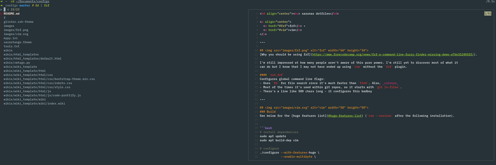

<h4 align="center"><br> sarunas dotfiles</h4>

<p align="center">
  <a href="#fzf">fzf</a> •
  <a href="#vim">vim</a>
</p>

---

## 
[Why you should be using fzf](https://www.freecodecamp.org/news/fzf-a-command-line-fuzzy-finder-missing-demo-a7de312403ff/).

I'm still impressed at how many people aren't aware of this [power](https://github.com/junegunn/fzf).
I'm yet to discover most of what it can do but I know that I may not have ended up using `vim` had I not discovered it.

#### `zsh_fzf`
Configures global command line flags:
* Uses `fd` for file search since it's faster than `find`. Also, _colours_.
* Same with `ripgrep` and `ag` versus `grep`. `locate` gets some love too.
* Most of the times it's used within git repos, so it starts with `git ls-files`.
* All that funky formatting logic belongs to this badboy's configuration:
<p align="center">
  </img>
</p>

--- file preview with code highlighting. It works in `vim` too - mostly useful to check diffs from previous commits.

---

## 
### Build


```bash
# install dependencies
sudo apt update
sudo apt build-dep vim

# configure
./configure --with-features=huge \
            --enable-cscope \
            --enable-gui=gtk3 \
            --enable-multibyte \
            --enable-luainterp=yes \
            --enable-perlinterp=yes \
            --enable-rubyinterp=yes \
            --enable-python3interp=yes \
            --with-python3-config-dir=$(python3-config --configdir) \
            --prefix=/usr/local

make VIMRUNTIMEDIR=/usr/local/share/vim/vim82

# install
make install
```

### Plugins
#### Staple #1 - [`fzf`](https://github.com/junegunn/fzf.vim)
No need to tell much, the list below (taken from the plugin's manual) shows what it can do _by default_.

I only used the `:Files` (opening files) and `:Ag` (searching within files) before I found
that there are more options. `:Buffers`, `:History`, `:Commits`, `:BCommits` are being constantly rinsed
while `:Maps`, `:Commands` and `:Helptags` are of great help during configuration.

<details>
  <summary><b>fzf commands in vim</b></summary>

| Command             | List                                                                        |
| ------------------- | ----------------------------------------------------------------------------|
| `:Files [PATH]`     | Files (runs  `$FZF_DEFAULT_COMMAND`  if defined)                            |
| `:GFiles [OPTS]`    | Git files ( `git ls-files` )                                                |
| `:GFiles?`          | Git files ( `git status` )                                                  |
| `:Buffers`          | Open buffers                                                                |
| `:Colors`           | Color schemes                                                               |
| `:Ag [PATTERN]`     | `ag` search result ( `ALT-A`  to select all,  `ALT-D`  to deselect all)     |
| `:Rg [PATTERN]`     | `rg` search result ( `ALT-A`  to select all,  `ALT-D`  to deselect all)     |
| `:Lines [QUERY]`    | Lines in loaded buffers                                                     |
| `:BLines [QUERY]`   | Lines in the current buffer                                                 |
| `:Tags [QUERY]`     | Tags in the project ( `ctags -R` )                                          |
| `:BTags [QUERY]`    | Tags in the current buffer                                                  |
| `:Marks`            | Marks                                                                       |
| `:Windows`          | Windows                                                                     |
| `:Locate PATTERN`   |  `locate`  command output                                                   |
| `:History`          |  `v:oldfiles`  and open buffers                                             |
| `:History:`         | Command history                                                             |
| `:History/`         | Search history                                                              |
| `:Snippets`         | Snippets (`UltiSnips`)                                                      |
| `:Commits`          | Git commits (requires {fugitive.vim}{8})                                    |
| `:BCommits`         | Git commits for the current buffer                                          |
| `:Commands`         | Commands                                                                    |
| `:Maps`             | Normal mode mappings                                                        |
| `:Helptags`         | Help tags [1]                                                               |
| `:Filetypes`        | File types                                                                  |

</details>

